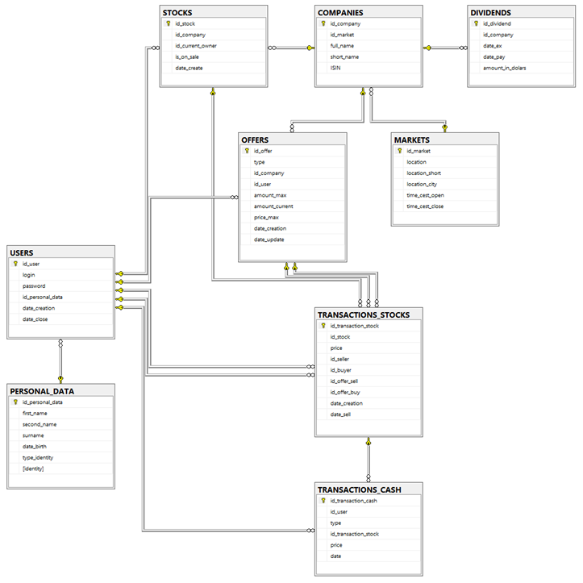

# StockMarket
Server application for the "Stock Market" simulation system.

## Technology Stack
* **slick**
* **akka-http**
* **cats**
* **cats-effect**
* **spray**
* **logback**
* **slf4j**

## Database Diagram

## Available endpoints
* http://{host}:{port}/{prefix}/portfolio /GET
* http://{host}:{port}/{prefix}/wallet /GET
* http://{host}:{port}/{prefix}/transaction /GET
* http://{host}:{port}/{prefix}/transaction/sell /GET
* http://{host}:{port}/{prefix}/transaction/sell/{idOffer} /PUT /DELETE
* http://{host}:{port}/{prefix}/transaction/buy /GET
* http://{host}:{port}/{prefix}/transaction/buy/{idOffer} /PUT /DELETE
* http://{host}:{port}/{prefix}/stock/{idCompany} /GET
* http://{host}:{port}/{prefix}/stock/{idCompany}/buy /POST
* http://{host}:{port}/{prefix}/stock/{idCompany}/sell /POST
* http://{host}:{port}/{prefix}/stock/{country} /GET
* http://{host}:{port}/{prefix}/user/singin /POST
* http://{host}:{port}/{prefix}/user /GET /POST /PUT
